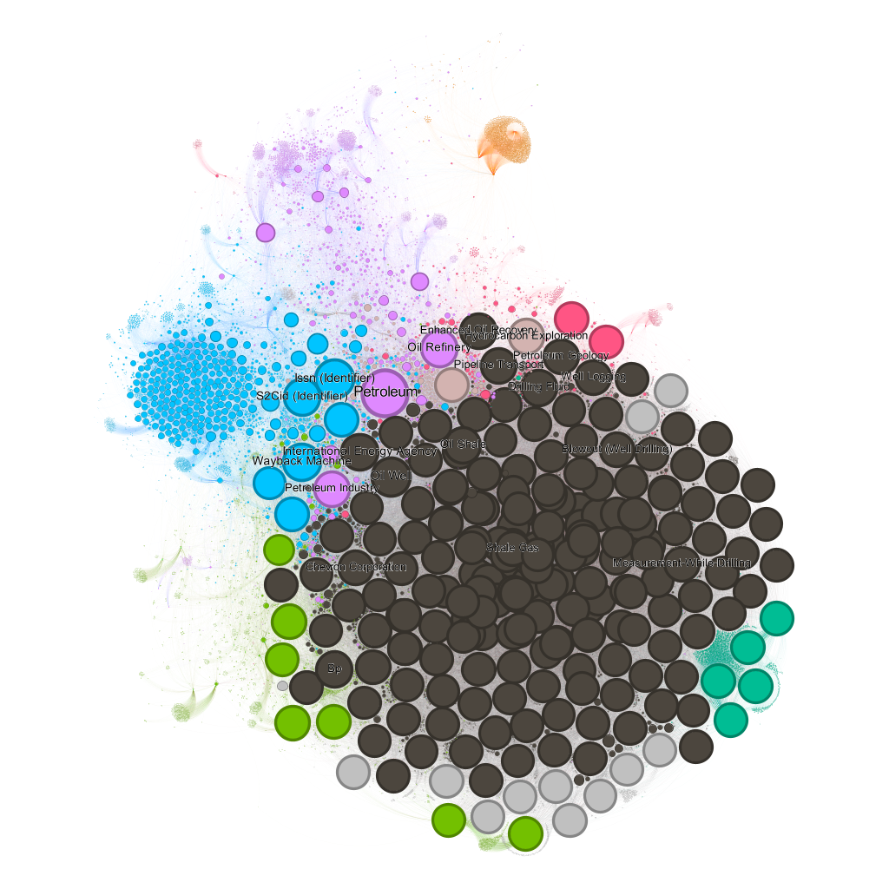

# U2T3

Este trabalho foi desenvolvido pelos componentes

- Raphael Ramos
- Ernane Ferreira

## Explicação do trabalho

Este trabalho tem como objetivo aplicar a teoria de Hubs, no contexto de grafos, em redes dirigidas compostas por páginas do Wikipedia. Nele, foram solicitados o cumprimento de cinco requisitos 

- **Requisito 1:** Gerar uma rede (grafo) dirigida a partir dos links das páginas do Wikipédia considerando a fusão de 4 SEEDs (páginas iniciais). As SEEDs deverão ser diferentes daquela fornecida no exemplo da semana 11. Limitar o nível de profundidade da rede para 2 (similar ao que foi demonstrado em sala de aula).

- **Requisito 2:** A partir da rede construída gerar uma figura que destaque as propriedades de centralidade da rede utilizando o Gephi, tais como degree centrality, closeness centrality, betweness centraliy e eigenvector centrality. As figuras devem ser acompanhadas de descrições/explicações. 

- **Requisito 3:** A partir da rede construída gerar uma figura que contenha os gráficos da Cumulative Density Function (CDF) e Probability Density Function (PDF) considerando o in-Degree dos vértices da rede. A figura deverá ser acompanhada de explicações/descrições.

- **Requisito 4:** A partir da rede construída gerar uma figura similar no gephi destacando o k-core e o k-shell da rede. O layout é de livre escolha. Os vértices devem ter um tamanho proporcional a propriedade in-degree. A figura deverá estar acompanhada de descrição/explicação.

- **Requisito 5:** A rede deverá estar em produção de forma análoga ao explicado na Semana 12. As cores deverão ser
relacionadas ao critério de comunidade e o tamanho do vértice a métrica in-degree.

## Requisito 1

As quatro páginas iniciais escolhidas para a construção da rede do trabalho estão relacionadas às indústrias do petróleo, gás e energias renováveis. Elas foram

- [Carbon and capture storage](https://en.wikipedia.org/wiki/Carbon_capture_and_storage)
- [Mud logging](https://en.wikipedia.org/wiki/Mud_logging)
- [Oil well](https://en.wikipedia.org/wiki/Oil_well)
- [Petroleum](https://en.wikipedia.org/wiki/Petroleum_geology)

Utilizou-se o algoritmo de *scraping* apresentado na [Week 11](../week-11/Wikipedia.ipynb) para transformar essas páginas do Wikipedia em uma rede direcionada e, após usar rotinas do NetworkX para uni-las em uma única rede, utilizou-se o *software* Gephi para criar uma visualização dela, como mostrado abaixos

Nessa representação, os nós são páginas do Wikipedia e as arestas são os links entre as páginas. Como é possível ver, duas estratégias foram utilizadas para essa representação: as cores dos nós  são relacionadas ao critério de comunidade e o tamanho deles à métrica in-degree. Dessa forma, é possível ver na figura que algumas páginas são mais citadas pelas outras, como Petroleum, Petroleum Industry e Oil Refiney, por causa do seu in-degree alto.

## Requisito 2

Ernane vai explicar tudo direitinho

> O algoritmo utilizado para montar a layout da rede foi o OpenOrd. No momento em que ele foi aplicado, notou-se que, durante as iterações, ele acabou sobrepondo nós com tamanhos maiores. Dessa forma, as representações abaixo podem dar a impressão que nossa rede diminuiu

## Requisito 3

Ernane vai explicar tudo direitinho

## Requisito 4

Na teoria de grafos, o k-core é o subconjunto de nós que possuem pelo menos grau k. Então, por exemplo, o 0-core contém todos os nós da rede, o 1-core contém os nós com pelo menos um vizinho, e assim sucessivamente. O k-shell, resumidamente, representa o subconjunto de nós removidos para alcançar o próximo k-core. A última camada da rede é o último k-core. Abaixo estão apresentados o k-core e o k-shell da rede construída.

A figura acima sugere uma interepretação interessante: o núcleo da nossa rede é um grafo fechado em que seus vértices possuem pelo menos grau 311, e há um único nó que se posiciona entre o 177-core e o 311-core. Esse único nó compõe o 177-shell da rede.

## Requisito 5

A rede construída está em produção no seguinte endereço [Wikipedia Network](https://raphaelramosds.github.io/netdeploy/)

## Artefatos

-  Implementações
-  Explicação geral