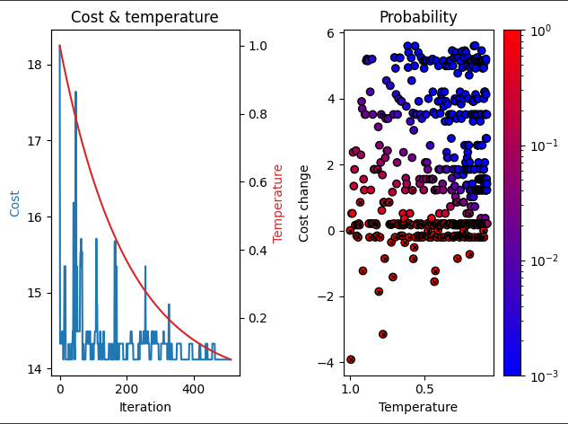

# Week 13 

## Tourist Route Optimization in Cities with Multiple Attractions

### Authors:
- Raphael Ramos
- Ernane Ferreira
- Thiago Lopes

---

## Project Description:

The goal of this project is to optimize a tourist route in a city with multiple attractions using algorithms and data structures. The main components of the project include:

1. **Selection of City and Tourist Attractions:**
   - The city selected for this project is Natal, Rio Grande do Norte, Brazil.
   - Tourist attractions include:
      - Catedral Metropolitana
      - Museu Câmara Cascudo
      - Teatro Alberto Maranhão
      - Arena das Dunas
      - Centro de Turismo

2. **Implementation of Simulated Annealing Algorithm:**
   - Utilizes the Simulated Annealing algorithm to find an optimized route.
   - The algorithm starts and ends at the Arena das Dunas.

3. **Development of User Interface based on Folium and Osmnx:**
   - Uses Folium and Osmnx to create a user interface for visualizing the optimized tourist route on a map.

4. **Simulation and Testing of Routes:**
   - Simulates and tests the optimized routes to ensure efficiency and pleasant experiences for visitors.

5. **Visualization of the Optimized Route:**
   - Provides a visual representation of the optimized tourist route.

### Selected Route for Analysis:

The route selected for analysis covers the following attractions: Catedral Metropolitana, Museu Câmara Cascudo, Teatro Alberto Maranhão, Arena das Dunas, and Centro de Turismo.

### Expected Results:

- An optimized tourist route that offers an efficient and enjoyable experience for visitors.
- Practical application and in-depth understanding of graph theory with optimization algorithms.

---

## Acknowledgment:

This project's code is based on the work available at [Conquering Seven Hills: Route Optimization with SA](https://omyllymaki.medium.com/conquering-seven-hills-route-optimization-with-sa-d96ace682e2c). We appreciate the valuable reference provided by this source.

---

## Optimized Route and Results:

| Base Parameters                             | Conservative Adjustment                      |
|---------------------------------------------|-----------------------------------------------|
|  |  |

| Moderate Adjustment                           | Aggressive Tuning                            |
|-----------------------------------------------|---------------------------------------------|
|  |  |

---

To access the code produced for this project, you can visit the [Assignment](https://colab.research.google.com/drive/15ic0w4d44vR3cYeJKV2gTtpjIrgKUA39?usp=drive_link) on Google Colab.

---

