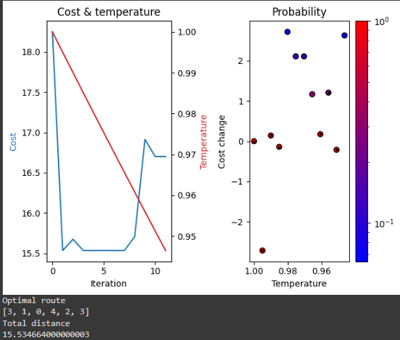

# U3T1

This project was developed by

- Raphael Ramos
- Ernane Ferreira
- Thiago Lopes

## Acknowledgment

This project's code is based on the work available at [Conquering Seven Hills: Route Optimization with SA](https://omyllymaki.medium.com/conquering-seven-hills-route-optimization-with-sa-d96ace682e2c). We appreciate the valuable reference provided by this source.

## Goals

The goal of this project is to optimize a tourist route in a city with multiple attractions using algorithms and data structures. The goals of this project are

1. Find the best route for visiting five keys tourist attractions on Natal/RN
2. Use the Simulated Annealing algorithm to find an optimized route that visits eache place once
3. Use Folium and Osmnx to create a user interface for visualizing the optimized tourist route on a map.
4. Simulate and tests the optimized routes to ensure efficiency and pleasant experiences for visitors.
5. Provide a visual representation of the optimized tourist route.

In order to access the code produced for this project, you can visit [Week 13 - Assignment](https://colab.research.google.com/drive/15ic0w4d44vR3cYeJKV2gTtpjIrgKUA39?usp=drive_link) on Google Colab.

## Development

Simulated Annealing is a stochastic optimization technique inspired by the physical process of metal annealing. Designed to find approximate solutions for global optimization problems, it is particularly useful in situations where finding the exact solution is computationally challenging. The key steps of this algorithm, applied to the problem of this project, are

**1. Initial solution generation:** we start with an initial solution. In our case, the solution is a list that represents a route that visits all attractions once. We've indexed the touristics attractions as 

- 0 (Catedral Metropolitana)
- 1 (Museu Câmara Cascudo)
- 2 (Teatro Alberto Maranhão)
- 3 (Arena das Dunas)
- 4 (Centro de Turismo)

Therefore a valid solution could be the vector [0, 3, 2, 1, 4, 0], if we starts from Catedral Metropolitana and goes back to it. We'll find an optimal route that starts from Arena das Dunas and ends at it

**2. Iterations and perturbations:** make small perturbations to current solutions to explore the solution space

**3. Objective function evaluation:** evaluate the objective function for the new solution. The objective function is the travelled distance in a certain route. We've evaluated this objective function by means of the distances matrix of the tourist attractions, introduced as follow

```
0.0 2.29 1.71 4.99 1.38
2.37 0.0 3.82 3.36 3.06
1.33 3.62 0.0 6.32 1.25
4.74 4.23 6.21 0.0 6.11
1.35 3.04 1.21 6.13 0.0
```

Each entry of this matrix represents the closest node in the graph to the coordinate of the tourist attraction. We've achieved this calculation by means of the library [OSMnx](https://osmnx.readthedocs.io/en/stable/), that seamslessly built a graph representation of the city we're working with. These entries are in the form $d_{ij}$, where $d$ is the shortest path between node $i$ and $j$. Notice that as we have five tourist attractions, we naturally end up with a square matrix $5 \times 5$

> The distances of this matrix were truncated for better representation. You can find them with all decimal places in the file assets/distances.txt

**4. Solution acceptance:** accept the new solution with a decreasing probability over time and simulated temperature, allowing acceptance of worse solutions.

**5. Temperature update:** gradually reduce the temperature to control the probability of accepting worse solutions.

**6. Stopping criterion:** continue iterating until meeting a stopping criterion. Our stop criterion was: a max number of iterations reached (max_iter), or a max number of iterations without improvement (max_iter_without_improvement)

## Route optimization

Below you can find the results of four experiments that were executed in order to find the optimal route

| Base parameters                             | Conservative adjustment                      |
|---------------------------------------------|-----------------------------------------------|
|   (max_iter=10, max_iter_without_improvement=1)|  (max_iter=50, max_iter_without_improvement=10) |

| Moderate adjustment                           | Aggressive tuning                            |
|-----------------------------------------------|---------------------------------------------|
|  (max_iter=100, max_iter_without_improvement=20) |  (max_iter=500, max_iter_without_improvement=100) |

Significant disparities were observed in the optimized routes and total distances covered across various parameter configurations. Each parameter setting in terms of max_iter and max_iter_without_improvement resulted in a distinct route, underscoring the influence of these values on the quest for the optimal solution. The alterations in parameters noticeably impacted the quality of the solutions, as evidenced by variations in the total distances traveled. Specifically:

- **Base Parameters:** the route obtained was [3, 2, 0, 4, 1, 3] with a total distance of 15.345993.
- **Conservative Adjustment:** the optimized route changed to [3, 1, 0, 4, 2, 3] with a total distance of 15.534664.
- **Moderate Adjustment:** the resulting route was [3, 4, 2, 0, 1, 3] with a reduced total distance of 14.326883.
- **Aggressive Tuning:** the most optimized route was [3, 0, 2, 4, 2, 3] with the smallest total distance of 14.119251.

The outcomes suggest that fine-tuning the parameters can substantially impact the quality of the solution produced by the optimizer. Higher values of max_iter and max_iter_without_improvement allowed for a more extensive exploration, leading to solutions with reduced total distances. However, it's crucial to note that increasing these values may also result in longer execution times. Therefore, the choice of parameters should be guided by a thoughtful consideration of the trade-off between solution quality and computational efficiency, tailored to the specific requirements of the given problem.

Based on the analysis of the "Cost change x Probability x Temperature" graph and the outcomes of the optimized routes, several conclusions can be drawn:

- **Base Parameters:** few and spaced points on the graph suggest limited exploration, potentially leading to suboptimal solutions, as indicated by the relatively high total distance.
- **Conservative Adjustment:** presence of points with varying shades of blue and red suggests a more balanced exploration of the solution space. The higher quantity of red points may indicate a more intense exploration locally.
- **Moderate Adjustment:** spaced points may indicate a more extensive exploration of the solution space. The presence of points between -2 and 5 suggests a broader search, enabling the discovery of higher-quality solutions.
- **Aggressive Tuning:** a significant number of points with blue, violet, and red shades, concentrated between 0 and 6, suggests an intensive and extensive exploration of the solution space. This resulted in the lowest total distance, indicating a more optimized solution.

# Result

Based on the discussions above we've selected the route with the minimum cost for displaying on this document. It can be visualized below


Notice that, at first glance, it's a weird route because we do not see a cyclic blue countour from our source (Arena das Dunas) to the destination (Arena das dunas). That's happened because, as it's clear, this route travels on a two-way highway along all the path.


