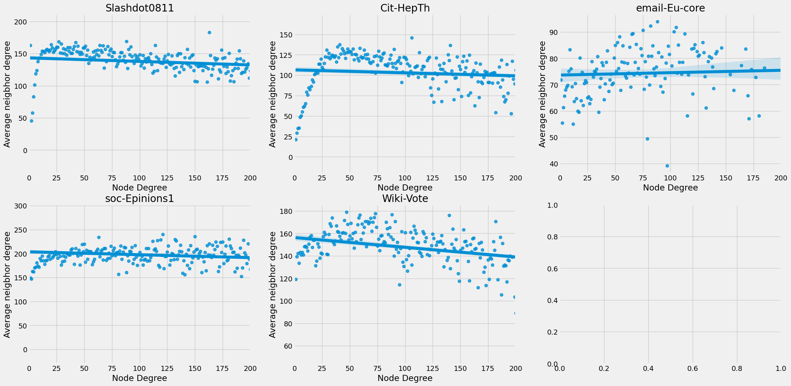

# Requisito 2

A assortatividade de uma rede mede a sua homofilia. Em outras palavras, essa métrica nos dar uma ideia da tendência dos nós em uma rede se conectarem com seus semelhantes.

Um métrica que pode nos ajudar a analisar a assortatividade de uma rede é a média dos graus vizinhos de nós que possuem um determinado grau (Average Neighbor Degree). Essa métrica é calculada da seguinte forma: dado um conjunto de nós com grau K em uma rede, somamos os graus dos seus vizinhos e encontramos a média desses valores. Observe que se fizermos esse cálculo para todos os graus possíveis da rede, podemos fazer algum tipo de regressão para estudar a tendência dessas médias em relação aos seus graus, e fazer considerações sobre a assortatividade da rede como um todo.

Assim, para cada uma das redes, contruiu-se um gráfico que relaciona o grau de cada nó na rede (Node Degree) e a média do graus de nós vizinhos que estão conectados a nós com esse grau (Average Neighbor Degree). Além do gráfico de dispersão, foi feita uma regressão linear para esboçar a reta que mais se adequava a esses pontos, como é possível ver na figura abaixo.

Todas as redes, com exceção da email-Eu-core, tiveram seus pontos ajustados por uma reta inclinada negativamente. A interpretação do coeficiente angular dessas retas tem haver com o Coeficiente Lienar de Pearson do grau. Retas com coeficiente positivos representam redes assortativas (como é o caso da rede email-Eu-core), em que nós com graus maiores tendem a se conectar com nós de graus maiores. Por outro lado, retas com coeficientes negativos rerpesentam redes dessassortativas (como é o caso das demais redes), em que nós com graus maiores tendem a se conectar com nós de graus diferentes.

A tendência da rede email-Eu-core network em ser assortativa implica que há grupos de usuários que enviam mais email entre eles, do que para outros usuários. A rede de citações High-energy physics theory citation network apresentar uma tendência a ser dessassortativa pode implicar que os seus artigos estão conectados com outros que não apresentam tanta referência na área, por terem menos citações, isto é, possuírem um grau menor. Na rede Epinions social network, a baixa assortatividade indica que a possibilidade de encontrar interações entre usuários que confiam em outros usuário é baixa. No caso da rede Slashdot social network, November 2008, a sua dessassortatividade pode estar relacionada com uma interação maior dos usuários que possuem avaliaram os outros como inimigos com aqueles que avaliaram como amigos. Finalmente, a desassortatividade da rede Wikipedia vote network está relacionada com a baixa probabilidade de encontramos bolhas de candidatos nessas eleições, isto é, pessoas que votaram nos mesmos candidatos a administrador de Wikipedia interagirem entre si.

A análise das assortatividades nas cinco redes distintas revelou um resultado intrigante: dos cinco grafos estudados, quatro deles demonstraram uma clara tendência de serem grafos desassortativos. Como foi observado, essa descoberta tiveram várias implicações, as quais dependeram do contexto dos grafos em estudo.